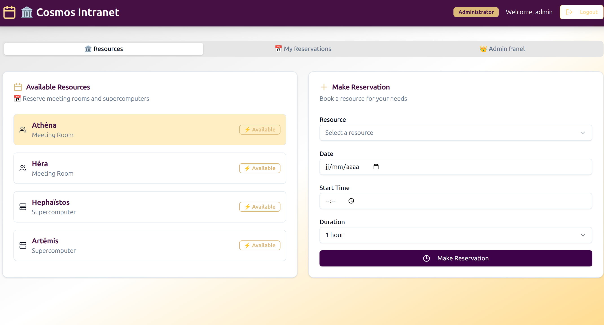
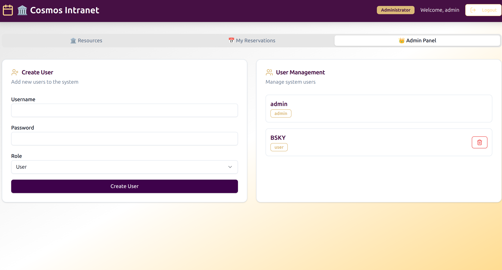
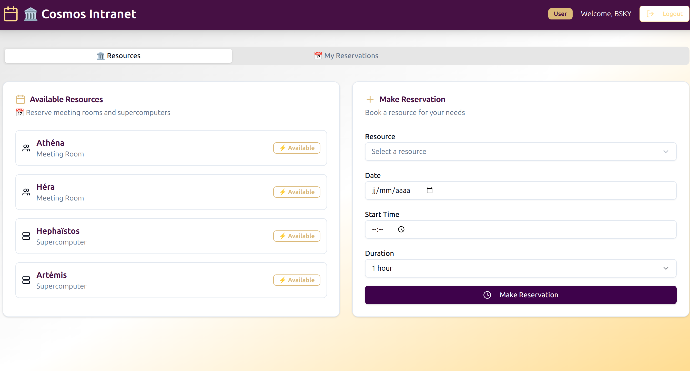

# Sélénée - Intranet Resource Management System



A modern, intranet application for managing company resources including meeting rooms and supercomputers. Built with Next.js, JavaScript, and MongoDB.

## 🌟 Features

### Core Functionality
- **Resource Management**: Meeting rooms (Athéna, Héra) and supercomputers (Hephaïstos, Artémis)
- **Smart Reservation System**: Fixed duration slots (30min, 1hr, 2hr) with conflict detection
- **User Authentication**: JWT-based authentication with role-based access control
- **Admin Panel**: User management, reservation oversight
- **Responsive Design**: Beautiful cosmos-branded UI with dark/light mode support


### Key Capabilities
- ✅ **Conflict Prevention**: Automatic detection of overlapping reservations
- ✅ **Role-Based Access**: Admin and user roles with appropriate permissions  
- ✅ **Real-time Updates**: Live reservation status and resource availability
- ✅ **Security**: JWT tokens, password hashing, input validation
- ✅ **Mobile Responsive**: Works seamlessly on all devices

## 🚀 Quick Start

### Option 1: Docker Compose (Recommended)

1. **Clone and navigate to the project:**
   ```bash
   git clone <repository-url>
   cd Selenee
   ```

2. **Start the application:**
   ```bash
   docker-compose up -d
   ```

3. **Access the application:**
   - Open your browser to http://localhost:3000
   - Login with admin credentials: `admin` / `admin`

### Option 2: Manual Setup

#### Prerequisites
- Node.js 18+ 
- MongoDB 7.0+
- Yarn package manager

#### Installation Steps

1. **Install dependencies:**
   ```bash
   yarn install
   ```

2. **Configure environment variables:**
   Create a `.env` file with:
   ```env
   MONGO_URL=mongodb://localhost:27017
   DB_NAME=cosmos_intranet
   JWT_SECRET=your_secure_jwt_secret_here
   NEXT_PUBLIC_BASE_URL=http://localhost:3000
   ```

3. **Start MongoDB:**
   ```bash
   mongod --dbpath /path/to/your/data
   ```

4. **Run the application:**
   ```bash
   # Development mode
   yarn dev
   
   # Production build
   yarn build
   yarn start
   ```

## 🏗️ Architecture

### Tech Stack
- **Frontend**: Next.js 14, React 18, TypeScript, Tailwind CSS, shadcn/ui
- **Backend**: Next.js API Routes, Node.js
- **Database**: MongoDB with native driver
- **Authentication**: JWT tokens, bcrypt password hashing
- **Styling**: Tailwind CSS with custom cosmos brand colors

### Project Structure
```
cosmos-intranet/
├── app/
│   ├── api/[[...path]]/route.js    # Backend API routes
│   ├── page.js                     # Main application UI
│   ├── layout.js                   # Root layout
│   └── globals.css                 # Global styles & cosmos branding
├── components/ui/                  # shadcn/ui components
├── lib/                           # Utility functions
├── Dockerfile                     # Docker configuration
├── docker-compose.yml             # Multi-container setup
└── README.md                      # This file
```

## 🎨 Cosmos Colors

- **Light Gray**: `#e6e6e6` - Background and neutral elements
- **Gold**: `#dbb979` - Secondary actions and accents  
- **Light Gold**: `#ffdb8d` - Highlights and hover states
- **Purple**: `#461044` - Primary brand color for headers and CTAs

## 📖 User Guide

### For Users
1. **Login**: Use your provided credentials to access the system
2. **View Resources**: Browse available meeting rooms and supercomputers
3. **Make Reservations**: Select resource, date, time, and duration
4. **Manage Bookings**: View and cancel your active reservations

### For Administrators  
1. **User Management**: Create and manage user accounts
2. **Full Access**: View and manage all reservations across the system
3. **System Oversight**: Monitor resource utilization and user activity

### Default Resources
- **Meeting Rooms**: 
  - Athéna (meeting_room)
  - Héra (meeting_room)
- **Supercomputers**:
  - Hephaïstos (supercomputer)  
  - Artémis (supercomputer)

## 🔧 Configuration

### Environment Variables
| Variable | Description | Default |
|----------|-------------|---------|
| `MONGO_URL` | MongoDB connection string | `mongodb://localhost:27017` |
| `DB_NAME` | Database name | `cosmos_intranet` |
| `JWT_SECRET` | Secret key for JWT tokens | *Required* |
| `NEXT_PUBLIC_BASE_URL` | Public application URL | `http://localhost:3000` |

### Default Accounts
- **Admin**: `admin` / `admin` (created automatically)

## 🔒 Security Features

- **JWT Authentication**: Secure token-based authentication
- **Password Hashing**: bcrypt with salt rounds for password security  
- **Role-Based Access**: Admin and user roles with appropriate permissions
- **Input Validation**: Server-side validation for all inputs
- **CORS Configuration**: Configurable cross-origin resource sharing
- **Security Headers**: X-Frame-Options, X-Content-Type-Options, CSP

## 🧪 Testing

The app includes comprehensive backend testing:

```bash
# Run backend tests
python3 backend_test.py
```

**Test Coverage:**
- ✅ Authentication system (login, JWT validation, role checking)
- ✅ User management (CRUD operations, admin protection)
- ✅ Resource management (default resource creation, fetching)
- ✅ Reservation system (conflict detection, CRUD operations)
- ✅ Database initialization (auto-setup of defaults)

## 🔄 API Endpoints

### Authentication
- `POST /api/auth/login` - User login
- `GET /api/auth/profile` - Get current user profile

### Resources
- `GET /api/resources` - List all resources

### Reservations  
- `GET /api/reservations` - Get user's reservations
- `POST /api/reservations` - Create new reservation
- `DELETE /api/reservations/{id}` - Delete reservation

### User Management (Admin Only)
- `GET /api/users` - List all users
- `POST /api/users` - Create new user
- `DELETE /api/users/{id}` - Delete user

## 🚨 Troubleshooting

### Common Issues

**MongoDB Connection Failed**
```bash
# Check MongoDB status
docker-compose logs mongo

# Restart MongoDB
docker-compose restart mongo
```

**JWT Token Issues**
- Ensure `JWT_SECRET` is set and consistent across restarts
- Tokens expire after 24 hours - users need to re-login

### Database Issues
```bash
# Reset database (WARNING: Deletes all data)
docker-compose down -v
docker-compose up -d
```

## 📊 Monitoring

### Health Checks
- Application: http://localhost:3000
- MongoDB: Connect via MongoDB client on port 27017

### Logs
```bash
# View application logs
docker-compose logs -f cosmos_app

# View database logs  
docker-compose logs -f mongo
```

## 🤝 Support

For technical support or feature requests:
1. Check the troubleshooting section above
2. Review application logs for error details
3. Verify environment variable configuration
4. Ensure MongoDB is running and accessible

## 📝 License

You're free to do whatever you want with the code, don't hesitate to fork or share your work !

